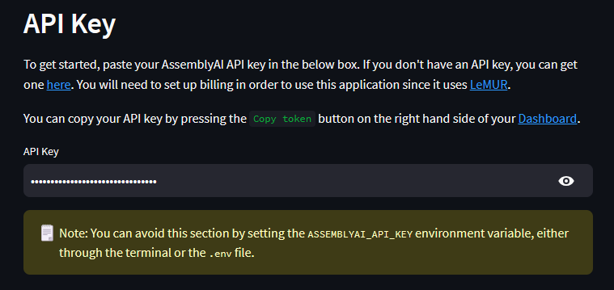
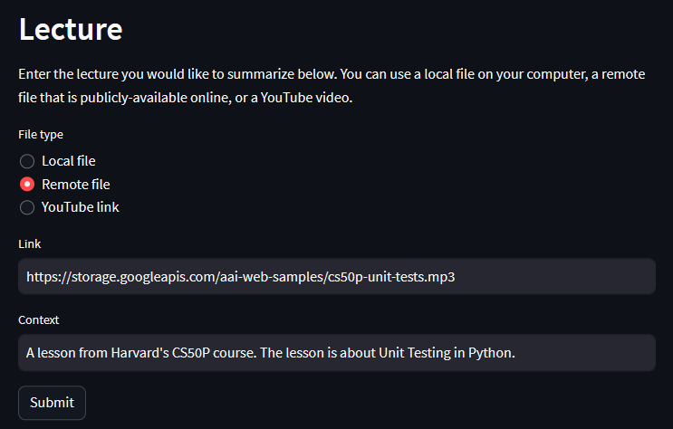
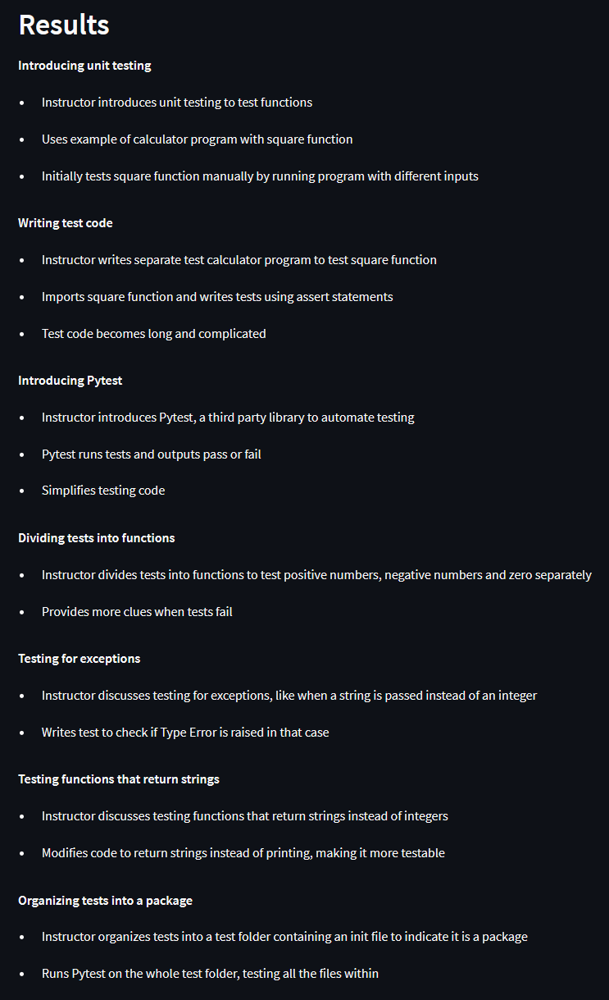
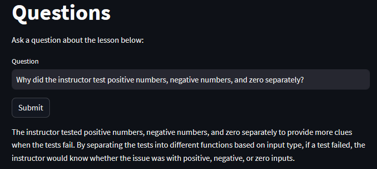

# LeMUR Lecture Summarizer

This application allows you to automatically summarize lectures and ask questions about the lesson material.

The application was tested with **Python 3.10.5**

## Prerequisites
You must have:
1. [Python](https://www.python.org/) installed
2. [pip](https://pip.pypa.io/en/stable/installation/) installed
3. An [AssemblyAI](https://www.assemblyai.com/dashboard/signup) account

## Setup

1. Clone this repository and cd into it
    ```bash
    git clone https://github.com/AssemblyAI-Examples/lemur-lecture-summarizer.git
    cd lemur-lecture-summarizer
    ```

2. Create and activate a virtual environment (optional)

    MacOS/Linux:
    ```bash
    python -m venv venv  # you may need to use `python3` instead
    source ./venv/bin/activate
    ```

    Windows:
    ```bash
    python -m venv venv  # you may need to use `python3` instead
    .\venv\Scripts\activate.bat
    ```

3. Install dependencies
    ```bash
    pip install -r requirements.txt
    ```

4. Set your AssemblyAI API Key (optional)

    In the `.env` file, replace `paste-your-key-here` with your AssemblyAI API key, which you can copy from your [Dashboard](https://www.assemblyai.com/dashboard/login). If you do not do this, you will be required to enter your API key in the application.

    Note that you will need to have set up billing to use this application since it utilizes [LeMUR](https://www.assemblyai.com/blog/lemur/).

## Run the application

1. Start the app
```bash
streamlit run app.py
```

2. Open the app
Click the link output in the terminal by the last command - the default is http://localhost:8501/

## Use the application

1. Enter your AssemblyAI API key if you did not follow step 4 in the [Setup](#setup) section

    

2. Select the lecture file

    You can use either an audio or video file, and the file can be locally stored, remotely stored (and publicly accessibly), or on YouTube.

    You can optionally add `Context` to provide contextualizing information about the lecture.

    

3. View the results

    Click "Submit" and wait for the results.

    Processing time will depend on the length of the file - hour long lectures may take several minutes to process.

    

4. Ask a question (optional)

    You can ask questions about the course content for further clarification

    
